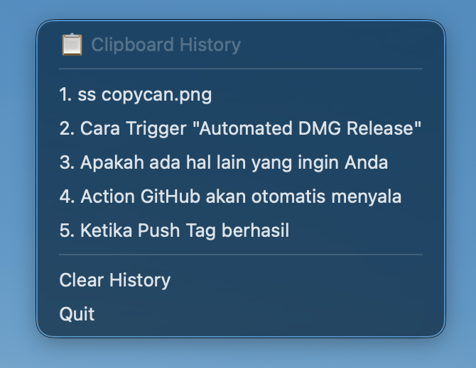

<h1 align="center">
  📋 CopyCan
</h1>

<p align="center">
  <b>Never lose a copied text again.</b><br/>
  A blazing-fast, ultra-lightweight clipboard history manager for macOS — written natively in Apple's Swift & AppKit.
</p>

<p align="center">
  <a href="https://github.com/firdaus1453/CopyCan/releases/latest"></a>
  
  
  
  
</p>

<p align="center">
  <a href="#-quick-install">Install</a> •
  <a href="#-features">Features</a> •
  <a href="#-how-it-works">How It Works</a> •
  <a href="#-build-from-source">Build</a> •
  <a href="#-contributing">Contributing</a>
</p>

---

<p align="center">
  
</p>

---

## 🚨 The Problem

You're working. You copy something important. You get distracted, copy something else — **and your previous clipboard is gone forever.**

macOS only keeps **one** item in the clipboard. There's no undo. There's no history. Just gone.

**CopyCan fixes this.** It silently watches your clipboard in the background and remembers everything you copy — so you never have to worry about losing a copied text ever again.

## ✨ Features

| | Feature | Description |
|---|---|---|
| ⚡️ | **Instant Access** | Press **`⌘ Shift V`** to pop up your full clipboard history at the cursor |
| 🪶 | **Micro-Sized** | **~250 KB** binary (Fat Universal format), leveraging macOS shared libraries natively |
| 👻 | **Invisible** | Runs as a menu bar icon only — no Dock icon, no windows |
| 💾 | **Persistent** | Saves your last 50 clips to disk seamlessly. Survives reboots |
| 🔒 | **Private** | 100% offline. No telemetry. No cloud. Your data stays on your Mac |
| 🍎 | **Universal** | Runs natively on both Apple Silicon (M-Series) and Intel Macs |

## 📥 Quick Install

1. Download **`CopyCan-v*.dmg`** (e.g. `CopyCan-v2.0.0.dmg`) from the [latest release](https://github.com/firdaus1453/CopyCan/releases/latest)
2. Open the `.dmg` and drag `CopyCan.app` → `Applications`
3. Launch from Spotlight or Launchpad
4. **First launch:** Right-click → Open → Open (to bypass Gatekeeper)

> **Tip:** Grant **Accessibility** permission in *System Settings → Privacy & Security → Accessibility* for the `⌘ Shift V` shortcut to work perfectly.

## 🧠 How It Works

```
You copy something → CopyCan saves it → Press ⌘⇧V → Pick any past clip → Cmd+V to paste
```

CopyCan leverages Apple's `NSPasteboard` and polls for changes efficiently. When it detects new text, it records it to a local history file (`~/.clipboard_history.txt`). Your history is always one shortcut away, anchored securely via low-level Carbon Hotkey events in the background.

## 🔨 Build From Source

**Prerequisites:** [Swift](https://swift.org/) and Xcode Command Line Tools

```bash
git clone https://github.com/firdaus1453/CopyCan.git
cd CopyCan
swift build -c release --arch arm64 --arch x86_64
```

**Package as `.app`:**
```bash
chmod +x create_app_bundle.sh
./create_app_bundle.sh
# → Creates CopyCan.app (drag to /Applications)
```

**Package as `.dmg`:**
```bash
chmod +x create_dmg.sh
./create_dmg.sh
```

Alternatively, just push a git tag (`v*`) to trigger automated GitHub Actions to release the `.dmg` with the Universal Binary!

## 🏗 Project Structure

```
CopyCan/
├── Sources/CopyCanSwift/      # All Swift application logic (main.swift)
├── Package.swift              # Swift Package Manager definition
├── create_app_bundle.sh       # .app packaging script
├── create_dmg.sh              # .dmg packaging script
├── assets/                    # Icon (.icns) and screenshots
└── .github/workflows/         # CI/CD: auto-build Universal Native macOS app on tag push
```

## ⚙️ Tech Stack

Building a micro-sized application on macOS demands zero third-party dependencies:
| Framework | Role |
|---|---|
| `AppKit / Cocoa` | Native macOS menu bar integration, `NSStatusItem`, and UI delegates |
| `NSPasteboard` | Instant clipboard read/write events |
| `Carbon HIToolbox` | Registering global hardware-level `⌘⇧V` shortcut safely |

No Electron. No heavy frameworks. Just 100% pure Swift and macOS APIs.

## 📊 Performance

| Metric | Value |
|---|---|
| Binary size | **~250 KB** (Fat/Universal Native) |
| Refresh interval | 500 ms efficient polling loop |
| CPU Usage | < 0.1% background |

## 🤝 Contributing

CopyCan is open source under the [MIT License](LICENSE). Contributions are welcome!

- 🐛 Found a bug? [Open an issue](https://github.com/firdaus1453/CopyCan/issues)
- 💡 Have an idea? [Start a discussion](https://github.com/firdaus1453/CopyCan/discussions)
- 🔧 Want to contribute? Fork, branch, PR — the usual!

---

<p align="center">
  <sub>Built with 🩵 by <a href="https://github.com/firdaus1453">@firdaus1453</a></sub>
</p>
